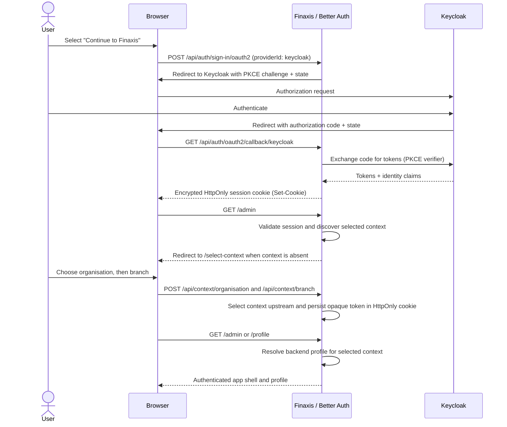
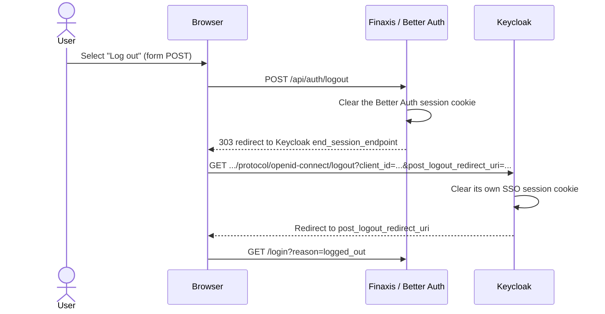

# Authentication architecture

Finaxis uses Better Auth as its OIDC client, with Keycloak as the identity
provider, entirely through same-origin `/api/auth/*` routes. The browser
never talks to Keycloak's token endpoint directly.

## Login sequence



## Logout sequence



## Components

- `auth/auth.ts` — the Better Auth server instance (Generic OAuth + `keycloak()`, stateless
  `jwe` cookie-cache sessions, `nextCookies()`).
- `app/api/auth/[...all]/route.ts` — Better Auth's own Next.js handler, mounted same-origin.
- `app/api/auth/logout/route.ts` — the custom, POST-only, validated Keycloak RP-initiated logout.
- `auth/auth-client.ts` — the browser-safe client used to start sign-in and (via the user menu's
  form) sign-out.
- `auth/get-authenticated-user.ts` / `auth/map-authenticated-user.ts` — the single server-side
  boundary between Better Auth's session shape and the application's `FinaxisUser` DTO.
- `auth/backend-api.ts` / `auth/context-service.ts` — server-only backend proxy and context/profile
  application service. Keycloak access tokens and the selected context token remain server-side.
- `app/select-context/page.tsx` / `components/context/context-selection-page.tsx` — shell-free
  organisation and branch selection UI, backed by same-origin route handlers.
- `app/(authenticated)/layout.tsx` — the authoritative, server-validated route guard.
- `proxy.ts` — optimistic, cookie-presence-only redirects; never the authorization boundary.

## Callback URL

```
http://localhost:3100/api/auth/oauth2/callback/keycloak   (this environment)
http://localhost:3000/api/auth/oauth2/callback/keycloak   (canonical/documented example)
```

See `docs/authentication/keycloak.md` for the full client configuration and
`docs/authentication/stateless-sessions.md` for the session model.
